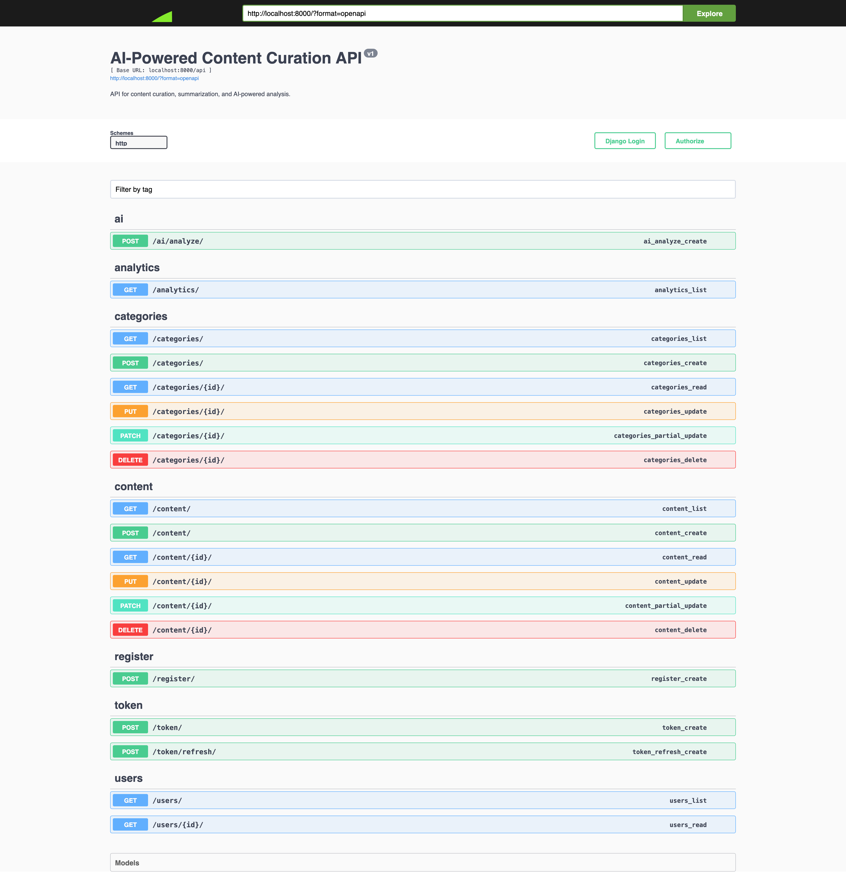
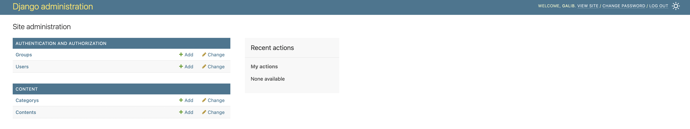
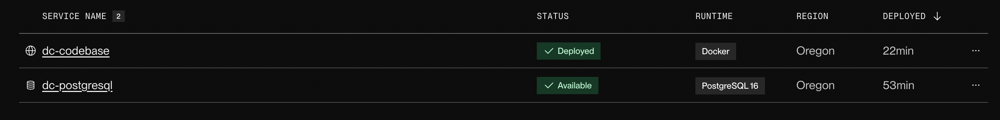

# AI-Powered Content Curation API

A modern DRF project with PostgreSQL, Docker, JWT Auth, CI, and AI-powered content analysis using GROQ. 
(**Python 3.12.0**)

---

## 🚀 Features

- **User Registration & Listing** (register new users, list users for admin)
- **Content & Category CRUD** with RBAC (public, user, admin)
- **Automatic AI analysis** (summary, sentiment, topics, recommendations) on content create/update/view
- **Manual AI analysis endpoint** for any text
- **JWT Authentication**
- **Swagger/OpenAPI docs**
- **Dockerized** for easy setup
- **CI with GitHub Actions**
- **Seed data & tests included**

---

## 🛠️ Setup Instructions

> **Note:** All commands below are for MacOS/Linux (bash shell). For Windows, use WSL or adapt commands accordingly.
>
> **Install Docker & Docker Compose for setup.**

### 1. **Clone the Repo**

```bash
  git clone <repo-url>
```
```bash
  cd <project-folder>
```

### 2. **Create and edit the .env file**

```bash
  touch .env
```

## 🌱 Environment Template (`.env.example`)

```env
# Django settings
SECRET_KEY=your-secret-key
DEBUG=True
ALLOWED_HOSTS=127.0.0.1,localhost

# PostgreSQL settings
POSTGRES_DB=contentdb
POSTGRES_USER=contentuser
POSTGRES_PASSWORD=contentpass
POSTGRES_HOST=db
POSTGRES_PORT=5432

# JWT settings (optional, will default to SECRET_KEY if not set)
JWT_SECRET_KEY=your-jwt-secret-key

# GROQ API KEY
GROQ_API_KEY=your-groq-api-key
```

> Copy & paste the `.env.example` contents to `.env` & set your config values.
>
> - `GROQ_API_KEY` (You must create a GROQ API key at https://console.groq.com/keys)
>
> The app will not work until you complete this step.

### 3. **Build Docker Images**

```bash
  docker-compose build
```

### 4. **Start Docker Containers**

```bash
  docker-compose up -d
```

### 5. **Apply Migrations**

```bash
  docker-compose exec web python manage.py makemigrations
```
```bash
  docker-compose exec web python manage.py migrate
```

### 6. **Seed Dummy Data**

```bash
  docker-compose exec web python manage.py loaddata content/misc/dummy_data.json
```

### 7. **Create a Superuser (Accessing through Django Admin)**

```bash
  docker-compose exec web python manage.py createsuperuser
```

### 8. **Collect Static Files**

```bash
  docker-compose exec web python manage.py collectstatic --noinput
```

### 9. **Run Tests**

```bash
  docker-compose exec web python manage.py test
```

---

## 🐳 Docker & CI

- **Docker**: All services (web, db) are containerized.
- **CI**: GitHub Actions runs tests on every push/PR using `.github/workflows/ci.yml`

---

## 🔑 Authentication

- Uses JWT (no session auth).
- Obtain a token via `/api/token/` (see Swagger docs).
- Use `Bearer <token>` in the `Authorization` header for all protected endpoints.

---

## 📚 API Documentation & Django Admin Panel

- **API Root**: [http://localhost:8000/](http://localhost:8000/)
- **Django Admin**: [http://localhost:8000/admin/](http://localhost:8000/admin/) `Use Superuser Credentials`

---

### Screenshots

* Root API Doc


* Django Admin Panel


* Render Deployment


---

## 🧠 AI Integration: GROQ

### **Automatic Analysis**

- On content create/update/view, the backend sends the content's body to the GROQ API.
- The AI returns a summary, sentiment, topics, and recommendations, which are saved in the database and returned in API responses.

### **Manual Analysis Endpoint**

- **POST** `/api/ai/analyze/`
- Authenticated users can send any text for on-demand AI analysis.
- Example payload:

```json
{
  "text": "Your text to analyze here."
}
```

- Example response:

```json
{
  "ai_result": "Summary: ... Sentiment: ... Topics: ... Recommendations: ..."
}
```

---

## 🧑‍💻 API Workthrough

### **User Endpoints**

- `POST /api/register/` — Register new user
- `POST /api/token/` — Obtain JWT token
- `POST /api/token/refresh/` — Refresh JWT token
- `GET /api/users/` — List all users (admin only)
- `GET /api/users/<id>/` — Retrieve user detail (admin only)

### **Content Endpoints**

- `GET /api/content/` — List/search content (public)
- `POST /api/content/` — Create content (user)
- `GET /api/content/<id>/` — Retrieve content (public)
- `PUT/PATCH/DELETE /api/content/<id>/` — Update/partial update/delete content (owner/admin)

### **Category Endpoints**

- `GET /api/category/` — List/search categories
- `POST /api/category/` — Create category (admin/user)
- `GET /api/category/<id>/` — Retrieve category
- `PUT/PATCH/DELETE /api/category/<id>/` — Update/partial update/delete category (admin only)

### **AI Endpoints**

- `POST /api/ai/analyze/` — Manual, on-demand AI analysis for any text

### **Analytics Endpoints**

- `GET /api/analytics/` — View analytics (admin only)

---

## 📝 Example Content Creation Payload (Generates automatic summary, sentiment, topics, and recommendations)

```json
{
  "title": "AI in Everyday Life",
  "body": "From smart assistants to personalized recommendations, artificial intelligence is becoming a part of our daily routines.",
  "category_id": 2,
  "metadata": {
    "source": "blog_post",
    "author": "Jane Doe"
  },
  "is_public": false
}
```

---

## 🛡️ RBAC (Role-Based Access Control)

- **Public**: Can view/search content and categories, register.
- **Authenticated User**: Can create/manage their own content, use AI endpoints.
- **Admin**: Can manage users, view analytics, manage all content.

---

## 📝 Combined API Access Table

| Endpoint/Action                        | Who Can Access           | Token Required | Login Required | Without Token (Response) |
| -------------------------------------- | ------------------------ | :------------: | :------------: | :----------------------: |
| `POST /api/register/`                  | Anyone                   |       No       |       No       |       201 Created        |
| `POST /api/token/`                     | Anyone                   |       No       |       No       |   200 OK / 401 Invalid   |
| `POST /api/token/refresh/`             | Authenticated User       |  Refresh JWT   |      Yes       |     401 Unauthorized     |
| `GET /api/users/`                      | Admin                    |      Yes       |      Yes       |     401 Unauthorized     |
| `GET /api/users/<id>/`                 | Admin                    |      Yes       |      Yes       |     401 Unauthorized     |
| `GET /api/content/`                    | Anyone (Public)          |       No       |       No       |          200 OK          |
| `POST /api/content/`                   | Authenticated User       |      Yes       |      Yes       |     401 Unauthorized     |
| `GET /api/content/<id>/`               | Anyone (Public)          |       No       |       No       |          200 OK          |
| `PUT/PATCH/DELETE /api/content/<id>/`  | Owner/Admin              |      Yes       |      Yes       |       401/403/404        |
| `GET /api/category/`                   | Anyone                   |       No       |       No       |          200 OK          |
| `POST /api/category/`                  | Authenticated User/Admin |      Yes       |      Yes       |     401 Unauthorized     |
| `GET /api/category/<id>/`              | Anyone                   |       No       |       No       |          200 OK          |
| `PUT/PATCH/DELETE /api/category/<id>/` | Admin                    |      Yes       |      Yes       |       401/403/404        |
| `POST /api/ai/analyze/`                | Authenticated User       |      Yes       |      Yes       |     401 Unauthorized     |
| `GET /api/analytics/`                  | Admin                    |      Yes       |      Yes       |     401 Unauthorized     |

**Notes:**

- "Token Required" means you must include a valid JWT in the `Authorization` header.
- "Login Required" means you must be authenticated (i.e., have a valid token).
- "Owner/Admin" for content means only the creator or an admin can modify/delete.
- 401 = Unauthorized, 403 = Forbidden, 404 = Not Found.

---

## 🚀 Render Live Demo (Deployment in progress...)

[https://dc-codebase.onrender.com/](https://dc-codebase.onrender.com/)

---